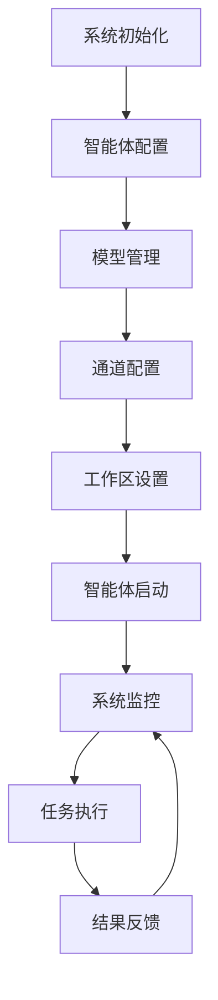

## 1. 产品概览
OpenClaw是一个智能体管理与协作平台，旨在为用户提供多智能体协同工作的能力，支持智能体的配置、监控和管理。
- 该平台解决了多智能体协调、模型管理和工作流自动化的问题，为用户提供统一的智能体管理界面。
- 平台的目标是成为智能体生态系统的核心管理工具，支持企业级智能体部署和协作。

## 2. 核心功能

### 2.1 功能模块
OpenClaw智能体管理系统包含以下主要页面：
1. **智能体管理页面**：智能体列表、智能体详情、智能体配置
2. **模型管理页面**：模型配置、模型测试、模型性能监控
3. **工作区管理页面**：工作区配置、文件管理、权限设置
4. **通道管理页面**：通道配置、连接状态监控、消息管理
5. **系统监控页面**：系统状态、日志查看、性能监控

### 2.2 页面详情

| 页面名称 | 模块名称 | 功能描述 |
|-----------|-------------|---------------------|
| 智能体管理页面 | 智能体列表 | 显示所有智能体的基本信息，包括ID、名称、状态、最后活动时间等。支持智能体的启动、停止、重启操作。 |
| 智能体管理页面 | 智能体详情 | 展示智能体的详细配置信息，包括模型设置、工作区路径、权限配置等。支持智能体配置的编辑和保存。 |
| 智能体管理页面 | 智能体配置 | 提供智能体的配置界面，包括模型选择、工作区设置、权限管理等。支持配置的导入和导出。 |
| 模型管理页面 | 模型配置 | 管理系统中可用的模型，包括模型的添加、编辑、删除操作。支持模型参数的配置。 |
| 模型管理页面 | 模型测试 | 提供模型测试界面，支持发送测试请求并查看模型响应。支持不同模型的性能对比。 |
| 模型管理页面 | 模型性能监控 | 监控模型的使用情况，包括响应时间、成功率、资源占用等。提供性能分析报告。 |
| 工作区管理页面 | 工作区配置 | 管理智能体的工作区，包括工作区路径设置、权限配置、存储空间管理等。 |
| 工作区管理页面 | 文件管理 | 提供工作区文件的浏览、上传、下载、删除等操作。支持文件的版本控制。 |
| 工作区管理页面 | 权限设置 | 设置工作区的访问权限，包括读写权限、执行权限等。支持基于角色的权限管理。 |
| 通道管理页面 | 通道配置 | 管理系统的通道设置，包括飞书、Discord等通道的配置。支持通道的启用和禁用。 |
| 通道管理页面 | 连接状态监控 | 监控通道的连接状态，包括在线状态、消息传递状态等。提供连接故障的报警机制。 |
| 通道管理页面 | 消息管理 | 管理通道的消息，包括消息的查看、搜索、删除等操作。支持消息的批量处理。 |
| 系统监控页面 | 系统状态 | 展示系统的整体状态，包括CPU、内存、磁盘使用情况等。提供系统健康状态的评估。 |
| 系统监控页面 | 日志查看 | 查看系统的运行日志，包括错误日志、警告日志、信息日志等。支持日志的搜索和过滤。 |
| 系统监控页面 | 性能监控 | 监控系统的性能指标，包括响应时间、吞吐量、并发数等。提供性能趋势分析。 |

## 3. Core Process
用户使用OpenClaw智能体管理系统的主要流程如下：

1. **系统初始化**：用户启动OpenClaw服务，系统加载配置文件并初始化各个组件。
2. **智能体配置**：用户通过智能体管理页面配置智能体的基本信息、模型设置、工作区路径等。
3. **模型管理**：用户在模型管理页面添加和配置模型，测试模型性能。
4. **通道配置**：用户在通道管理页面配置飞书、Discord等通道，建立智能体与外部系统的连接。
5. **工作区设置**：用户在工作区管理页面设置智能体的工作区路径和权限。
6. **智能体启动**：用户启动智能体，智能体开始运行并处理任务。
7. **系统监控**：用户通过系统监控页面监控智能体的运行状态和系统性能。
8. **任务执行**：智能体执行用户分配的任务，包括信息收集、分析、处理等。
9. **结果反馈**：智能体将执行结果反馈给用户，用户可以查看和评估结果。

## 4. 用户接口设计
### 4.1 设计风格
- **主色**：蓝色 (#1E88E5)，代表专业和信任
- **辅色**：绿色 (#4CAF50) 用于成功状态，红色 (#F44336) 用于错误状态，黄色 (#FFC107) 用于警告状态
- **按钮样式**：圆角矩形按钮，悬停时有轻微阴影效果
- **字体**：系统默认字体，标题使用16-20px，正文使用14px，小文本使用12px
- **布局样式**：左侧固定导航栏，右侧内容区，顶部状态栏
- **图标样式**：使用Material Design风格的图标，简洁明了

### 4.2 页面设计概览

| 页面名称 | 模块名称 | UI元素 |
|-----------|-------------|-------------|
| 智能体管理页面 | 智能体列表 | 表格形式展示智能体信息，包含ID、名称、状态、最后活动时间等列。每行有操作按钮（启动、停止、重启、编辑）。支持分页和搜索功能。 |
| 智能体管理页面 | 智能体详情 | 卡片式布局，展示智能体的详细信息。包含基本信息、模型配置、工作区设置等部分。每个部分有编辑按钮。 |
| 智能体管理页面 | 智能体配置 | 表单布局，包含模型选择下拉框、工作区路径输入框、权限设置复选框等。底部有保存和取消按钮。 |
| 模型管理页面 | 模型配置 | 表格形式展示模型信息，包含模型ID、名称、提供商、状态等列。支持模型的添加、编辑、删除操作。 |
| 模型管理页面 | 模型测试 | 包含模型选择下拉框、测试输入文本框、测试按钮、响应显示区域。支持测试历史记录的查看。 |
| 模型管理页面 | 模型性能监控 | 图表形式展示模型的性能指标，包括响应时间、成功率、资源占用等。支持时间范围选择。 |
| 工作区管理页面 | 工作区配置 | 表单布局，包含工作区路径输入框、存储空间设置、权限配置等。底部有保存和取消按钮。 |
| 工作区管理页面 | 文件管理 | 树形结构展示工作区文件，支持文件的上传、下载、删除、重命名等操作。包含搜索功能。 |
| 工作区管理页面 | 权限设置 | 表格形式展示用户权限，包含用户名、角色、权限级别等列。支持权限的编辑和管理。 |
| 通道管理页面 | 通道配置 | 卡片式布局，每个通道有独立的配置卡片。包含通道名称、状态、配置按钮等。 |
| 通道管理页面 | 连接状态监控 | 仪表盘形式展示通道的连接状态，包含在线状态、消息传递状态等。支持状态的实时更新。 |
| 通道管理页面 | 消息管理 | 表格形式展示消息记录，包含消息ID、通道、发送时间、内容等列。支持消息的搜索和过滤。 |
| 系统监控页面 | 系统状态 | 仪表盘形式展示系统的整体状态，包含CPU、内存、磁盘使用情况等。支持状态的实时更新。 |
| 系统监控页面 | 日志查看 | 文本区域展示系统日志，支持日志的搜索、过滤、导出等操作。包含日志级别选择。 |
| 系统监控页面 | 性能监控 | 图表形式展示系统的性能指标，包括响应时间、吞吐量、并发数等。支持时间范围选择。 |

### 4.3 自适应
- **桌面端**：完整功能，左侧导航栏固定，右侧内容区自适应宽度
- **平板端**：左侧导航栏可折叠，内容区自适应宽度
- **移动端**：底部导航栏，内容区垂直滚动，简化部分复杂操作

系统支持响应式设计，确保在不同设备上都能良好显示和操作。对于触屏设备，提供更大的点击区域和更简洁的界面。