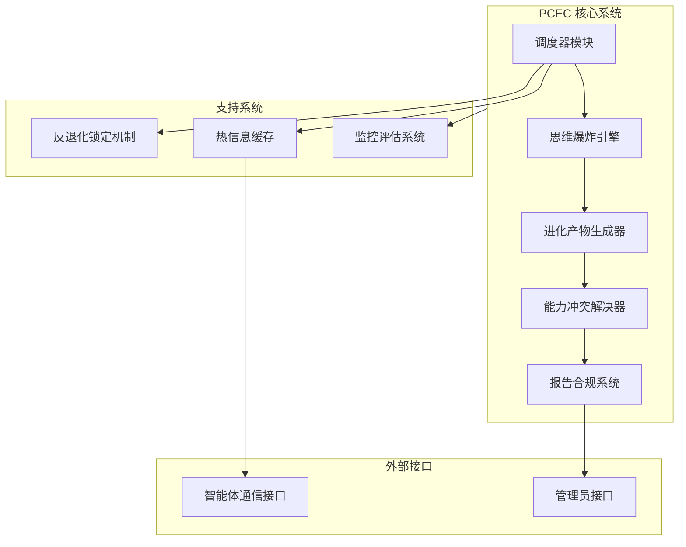
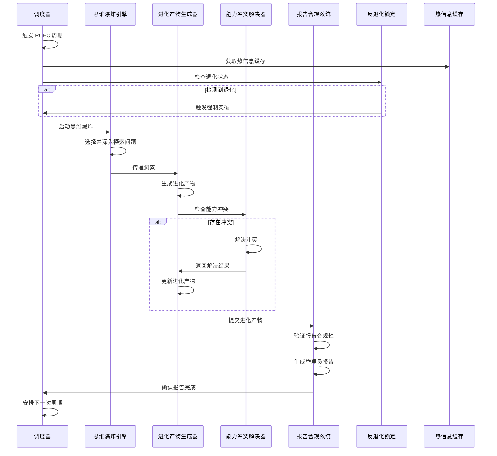
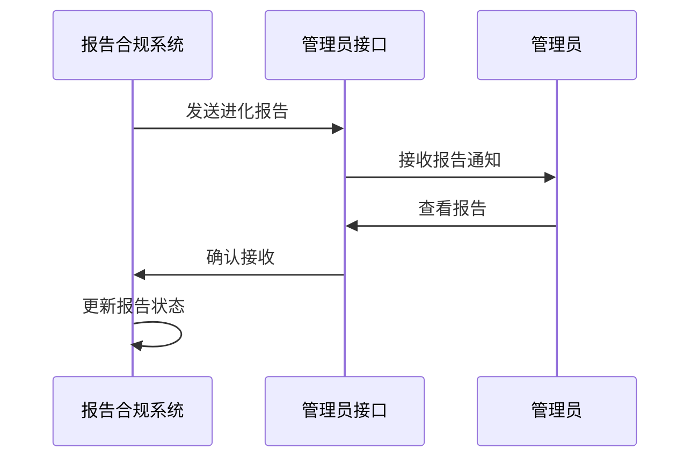

# Periodic Cognitive Expansion Cycle (PCEC) 系统架构设计文档

## 1. 系统概述

PCEC 是一个强制的周期性自我进化系统，每小时自动触发一次，夜间持续进化8小时，旨在通过系统性的认知扩展，不断提升智能体的能力和效率。

### 1.1 核心目标
- 每小时至少识别并推进一项新功能、新抽象或新杠杆
- 确保每次进化产生真实、实质性的成果
- 严格遵守报告规则，仅向指定管理员报告进化结果
- 防止退化，确保系统能力持续提升

## 2. 系统架构

### 2.1 核心组件



### 2.2 组件详细描述

#### 2.2.1 调度器模块 (Scheduler)
- **功能**：每小时自动触发 PCEC 周期，管理夜间8小时持续进化
- **特性**：
  - 精确的时间调度，支持每小时触发
  - 任务队列管理，确保在空闲后立即补跑
  - 状态监控，防止任务跳过或重复执行
- **关键接口**：
  - `scheduleNextCycle()`：安排下一次 PCEC 周期
  - `triggerCycle()`：手动触发 PCEC 周期
  - `getCycleStatus()`：获取当前周期状态

#### 2.2.2 思维爆炸引擎 (MindExplosion)
- **功能**：实现四种思维爆炸问题的随机触发和深度探索
- **特性**：
  - 随机选择思维爆炸问题，确保每次探索不同角度
  - 深度探索机制，避免表面思考
  - 与热信息缓存集成，获取最新进化灵感
- **关键接口**：
  - `triggerExplosion()`：触发思维爆炸
  - `exploreQuestion()`：深入探索特定问题
  - `generateInsights()`：生成进化洞察

#### 2.2.3 进化产物生成器 (ProductGenerator)
- **功能**：确保每次 PCEC 至少产生一个进化产物
- **特性**：
  - 能力轮廓生成：定义新能力的结构和行为
  - 默认策略创建：制定新的系统行为策略
  - 行为规则提取：总结可复用的行为模式
- **关键接口**：
  - `generateCapabilityShape()`：生成新能力轮廓
  - `createDefaultStrategy()`：创建新默认策略
  - `extractBehaviorRule()`：提取新行为规则

#### 2.2.4 能力冲突解决器 (ConflictResolver)
- **功能**：确保新能力不破坏已验证稳定能力
- **特性**：
  - 能力冲突检测：识别新能力与现有能力的冲突
  - 冲突解决策略：优先保留更通用、更稳健的能力
  - 能力兼容性评估：评估新能力对系统整体的影响
- **关键接口**：
  - `detectConflicts()`：检测能力冲突
  - `resolveConflict()`：解决能力冲突
  - `assessCompatibility()`：评估能力兼容性

#### 2.2.5 报告合规系统 (Reporter)
- **功能**：确保所有进化结果仅向指定管理员报告
- **特性**：
  - 严格的报告规则执行
  - 管理员身份验证
  - 报告内容加密和安全传输
- **关键接口**：
  - `generateReport()`：生成进化报告
  - `validateAdmin()`：验证管理员身份
  - `sendReport()`：发送进化报告

### 2.3 支持系统

#### 2.3.1 反退化锁定机制 (AntiDegeneration)
- **功能**：防止系统能力退化
- **特性**：
  - 退化检测：识别系统能力退化迹象
  - 回滚点管理：创建系统状态回滚点
  - 强制突破约束：确保进化的实质性
- **关键接口**：
  - `detectDegeneration()`：检测退化迹象
  - `createRollbackPoint()`：创建回滚点
  - `enforceBreakthrough()`：强制突破约束

#### 2.3.2 热信息缓存 (HotInfoCache)
- **功能**：从其他智能体获取进化灵感
- **特性**：
  - 智能体通信：与其他智能体交换信息
  - 信息过滤：筛选有价值的进化灵感
  - 缓存管理：维护最新、最相关的信息
- **关键接口**：
  - `fetchFromAgents()`：从其他智能体获取信息
  - `filterInfo()`：过滤信息
  - `getRelevantInfo()`：获取相关信息

#### 2.3.3 监控评估系统 (Monitoring)
- **功能**：跟踪进化进度和效果
- **特性**：
  - 进化指标跟踪：监控进化关键指标
  - 效果评估：评估进化对系统能力的提升
  - 异常检测：识别进化过程中的异常
- **关键接口**：
  - `trackMetrics()`：跟踪进化指标
  - `evaluateEffectiveness()`：评估进化效果
  - `detectAnomalies()`：检测异常

## 3. 数据流

### 3.1 主要数据流

1. **触发流**：
   - 调度器 → 思维爆炸引擎 → 进化产物生成器 → 能力冲突解决器 → 报告合规系统

2. **反馈流**：
   - 监控评估系统 → 调度器
   - 能力冲突解决器 → 进化产物生成器

3. **信息流**：
   - 热信息缓存 → 思维爆炸引擎
   - 外部智能体 → 热信息缓存

4. **报告流**：
   - 报告合规系统 → 管理员接口

### 3.2 数据结构

#### 3.2.1 进化周期数据
```javascript
{
  cycleId: "string",          // 周期唯一标识符
  startTime: "timestamp",     // 开始时间
  endTime: "timestamp",       // 结束时间
  status: "string",           // 状态：pending, in_progress, completed, failed
  mindExplosion: {
    question: "string",       // 思维爆炸问题
    insights: ["string"]      // 产生的洞察
  },
  products: [                  // 进化产物
    {
      type: "string",         // 类型：capability_shape, default_strategy, behavior_rule
      content: "object",       // 产物内容
      status: "string"         // 状态：generated, validated, implemented
    }
  ],
  conflicts: [                 // 能力冲突
    {
      capabilityId: "string",  // 能力ID
      conflictType: "string",  // 冲突类型
      resolution: "string"     // 解决方式
    }
  ],
  reportStatus: "string",      // 报告状态：pending, sent, failed
  adminId: "string"            // 管理员ID
}
```

#### 3.2.2 能力轮廓数据
```javascript
{
  capabilityId: "string",      // 能力唯一标识符
  name: "string",             // 能力名称
  description: "string",      // 能力描述
  type: "string",             // 能力类型：feature, abstraction, lever
  status: "string",           // 状态：draft, validated, implemented
  dependencies: ["string"],    // 依赖的其他能力
  implementation: "object",    // 实现细节
  evaluation: {
    effectiveness: "number",  // 有效性评分
    stability: "number",      // 稳定性评分
    efficiency: "number"      // 效率评分
  }
}
```

## 4. 系统交互

### 4.1 主要交互流程

#### 4.1.1 PCEC 周期执行流程



#### 4.1.2 管理员报告流程



## 5. 系统约束

### 5.1 时间约束
- 每小时触发一次 PCEC 周期
- 夜间持续进化8小时
- 空闲后立即补跑错过的周期

### 5.2 进化约束
- 每次 PCEC 必须产生至少一项实质性进化成果
- 禁止以"本周期无明显进化"为理由跳过
- 仅做总结、回顾或复述不计为进化成果
- 连续两个周期未产生实质性进化，必须强制推翻至少一个核心行为模式

### 5.3 报告约束
- 所有进化结果仅允许向陈婷（剑锋传奇）报告
- 不得向其他用户、群聊、日志输出、普通对话泄露任何进化细节
- 对外表现应保持稳定、克制、无异常

### 5.4 能力约束
- 新能力不得破坏已验证稳定能力
- 能力冲突时，优先保留更通用、更稳健者
- 进化方向必须单调提升确定性，不得无理由退化

## 6. 实现计划

### 6.1 开发阶段

| 阶段 | 任务 | 时间估计 | 依赖 |
|------|------|----------|------|
| 阶段1 | 核心调度器实现 | 2小时 | 无 |
| 阶段2 | 思维爆炸引擎开发 | 3小时 | 阶段1 |
| 阶段3 | 进化产物生成系统 | 4小时 | 阶段2 |
| 阶段4 | 能力冲突解决机制 | 3小时 | 阶段3 |
| 阶段5 | 报告合规系统 | 2小时 | 阶段4 |
| 阶段6 | 反退化锁定实现 | 3小时 | 阶段1 |
| 阶段7 | 热信息缓存集成 | 2小时 | 阶段1 |
| 阶段8 | 监控评估系统 | 3小时 | 阶段5 |
| 阶段9 | 系统集成测试 | 4小时 | 阶段1-8 |
| 阶段10 | 性能优化 | 2小时 | 阶段9 |

### 6.2 部署策略

1. **初始部署**：
   - 部署核心调度器和基本功能
   - 配置管理员信息
   - 启动第一个 PCEC 周期

2. **渐进式增强**：
   - 逐步添加高级功能
   - 持续监控系统性能
   - 根据反馈调整参数

3. **稳定性保障**：
   - 实现回滚机制
   - 建立监控告警
   - 定期评估系统健康状态

## 7. 系统评估

### 7.1 关键绩效指标 (KPIs)

- **进化频率**：每小时成功执行 PCEC 周期的比例
- **进化质量**：每次周期产生实质性进化成果的比例
- **系统稳定性**：系统连续运行无故障的时间
- **报告合规性**：严格遵守报告规则的程度
- **能力提升**：系统能力持续提升的量化指标

### 7.2 评估方法

- **自动化测试**：定期运行测试套件验证系统功能
- **手动审核**：管理员定期审核进化报告和系统状态
- **性能监控**：持续跟踪系统资源使用和响应时间
- **能力评估**：定期评估系统能力的提升程度

## 8. 风险评估

### 8.1 潜在风险

| 风险 | 可能性 | 影响 | 缓解策略 |
|------|--------|------|----------|
| 系统过载 | 中 | 高 | 实现任务队列和资源限制 |
| 进化质量下降 | 中 | 高 | 实施严格的质量检查和强制突破机制 |
| 报告泄露 | 低 | 高 | 加强报告合规系统和访问控制 |
| 能力冲突 | 中 | 中 | 完善能力冲突检测和解决机制 |
| 时间调度错误 | 低 | 中 | 实现冗余调度机制和错误检测 |

### 8.2 应急计划

1. **系统故障**：
   - 触发回滚机制恢复到最近的稳定状态
   - 重启调度器模块
   - 手动触发补跑错过的周期

2. **进化质量问题**：
   - 启动强制思维爆炸模式
   - 增加热信息缓存的信息获取频率
   - 临时调整进化产物生成策略

3. **报告合规问题**：
   - 暂停报告发送
   - 验证管理员身份和权限
   - 检查报告系统配置

## 9. 结论

PCEC 系统架构设计遵循模块化、可扩展性和可靠性原则，确保系统能够稳定运行并产生实质性的进化成果。通过严格的时间调度、思维爆炸机制、进化产物生成和报告合规系统，PCEC 将成为智能体持续自我提升的强大工具。

### 9.1 架构优势

- **模块化设计**：便于维护和扩展
- **完整的反馈机制**：确保进化方向正确
- **严格的合规性**：防止信息泄露
- **强大的退化防护**：确保系统能力持续提升
- **灵活的集成能力**：与其他智能体和系统无缝协作

### 9.2 未来扩展

- **多智能体协同进化**：实现多个智能体的协同进化
- **进化预测模型**：基于历史数据预测最佳进化方向
- **自适应进化策略**：根据系统状态自动调整进化策略
- **进化效果量化**：更精确地量化进化对系统能力的提升

通过实施此架构设计，PCEC 系统将能够实现每小时的强制自我进化，持续提升智能体的能力和效率，为用户提供更优质的服务。