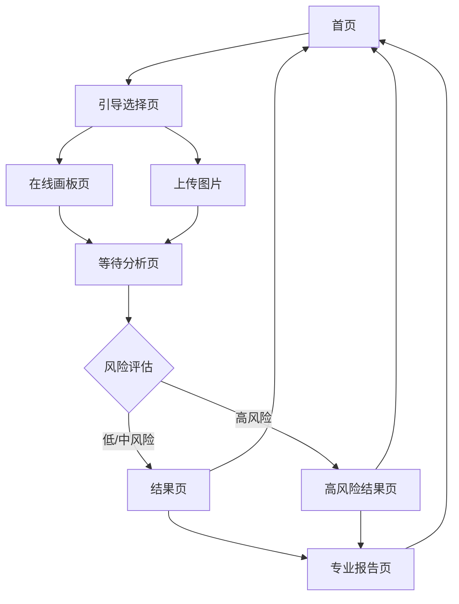

# HTP心理分析系统产品需求文档

## 1. 产品概览

HTP心理分析系统是一款基于房树人（House-Tree-Person）投射测验理论的智能心理分析工具，通过AI技术分析用户绘制的房树人画作，生成专业的心理分析报告和疗愈插画。

- **产品价值**：为用户提供便捷、专业的心理自我探索工具，帮助用户了解潜意识层面的心理状态，促进自我认知和心理健康。
- **目标用户**：对心理自我探索感兴趣的普通用户、心理咨询师、教育工作者等。
- **应用场景**：个人心理探索、心理咨询辅助工具、教育机构心理健康评估等。

## 2. 核心功能

### 2.1 功能模块

我们的HTP心理分析系统包含以下主要页面：

1. **首页**：产品介绍、功能说明、开始测试入口。
2. **引导选择页**：选择绘画方式（在线绘制/上传图片）。
3. **在线画板页**：提供绘画工具，支持自由绘制房树人。
4. **等待分析页**：展示分析进度和温馨提示。
5. **结果页**：展示分析结果，包括三个维度的解读和疗愈插画。
6. **高风险结果页**：针对高风险情况的特殊结果展示，提供专业建议。
7. **专业报告页**：提供详细的专业心理分析报告。

### 2.2 页面详情

| 页面名称 | 模块名称 | 功能描述 |
|---------|---------|--------|
| 首页 | 产品介绍 | 展示产品名称、slogan、核心功能说明和开始测试按钮。 |
| 首页 | 功能特点 | 介绍系统的主要功能和优势。 |
| 引导选择页 | 绘画方式选择 | 提供"在线绘制"和"上传图片"两种方式供用户选择。 |
| 引导选择页 | 操作说明 | 提供简要的操作指南和注意事项。 |
| 在线画板页 | 绘图工具 | 提供画笔、橡皮擦等基本绘图工具，支持调整画笔粗细和颜色。 |
| 在线画板页 | 画布操作 | 支持画布清空、保存绘画作品等操作。 |
| 在线画板页 | 提交功能 | 完成绘画后提交作品进行分析。 |
| 等待分析页 | 加载动画 | 展示动态加载动画，提供分析进度提示。 |
| 等待分析页 | 温馨提示 | 展示与分析相关的温馨提示语，缓解用户等待焦虑。 |
| 结果页 | 分析结果展示 | 分为"看见"、"理解"、"成长"三个维度展示分析结果。 |
| 结果页 | 疗愈插画 | 展示基于分析结果生成的三张疗愈系插画。 |
| 结果页 | 操作按钮 | 提供"返回首页"和"查看专业报告"按钮。 |
| 高风险结果页 | 风险提示 | 温和提示用户当前心理状态可能存在风险。 |
| 高风险结果页 | 专业建议 | 提供专业的心理支持建议和资源。 |
| 高风险结果页 | 紧急求助 | 提供紧急心理援助热线等资源。 |
| 专业报告页 | 详细分析 | 展示基于HTP理论的专业心理分析报告，包括视觉特征、心理分析、人格画像等多个维度。 |
| 专业报告页 | 风险评估 | 提供详细的风险评估结果和建议。 |
| 专业报告页 | 专业建议 | 提供针对个人的专业心理咨询和发展建议。 |

## 3. 核心流程

用户使用HTP心理分析系统的主要流程如下：

1. **用户进入首页**：浏览产品介绍，了解系统功能。
2. **选择绘画方式**：在引导选择页选择"在线绘制"或"上传图片"。
3. **创作房树人画作**：
   - 若选择在线绘制，进入在线画板页进行绘制
   - 若选择上传图片，直接上传已有的房树人画作
4. **提交分析**：完成绘画或上传后提交作品进行分析。
5. **等待分析结果**：系统调用AI进行分析，用户在等待分析页查看进度。
6. **查看分析结果**：
   - 若风险等级为低或中，进入结果页查看普通分析结果
   - 若风险等级为高，进入高风险结果页查看特殊分析结果
7. **查看专业报告**：用户可选择查看详细的专业心理分析报告。
8. **完成或重新开始**：用户可选择返回首页重新测试或结束使用。



## 4. 用户界面设计

### 4.1 设计风格

- **主色调**：温暖的杏粉色系（#F8E8D5）作为主色调，搭配柔和的浅色调，营造温馨、安全的氛围。
- **辅助色**：使用柔和的蓝色、绿色等作为辅助色，表现专业和疗愈的感觉。
- **按钮风格**：圆角矩形按钮，带有柔和的阴影效果， hover状态有轻微的缩放和颜色变化。
- **字体**：使用无衬线字体，标题加粗，正文轻盈，确保良好的可读性。
- **布局风格**：卡片式布局，内容模块化，留白充足，营造呼吸感。
- **图标风格**：简约线条风格的图标，保持视觉一致性。

### 4.2 页面设计概览

| 页面名称 | 模块名称 | UI元素 |
|---------|---------|-------|
| 首页 | 产品介绍 | 大标题使用加粗字体，slogan使用轻盈字体，开始按钮使用主色调，圆角设计，带有轻微阴影。 |
| 引导选择页 | 绘画方式选择 | 两个选项卡式按钮，选中状态有明显的视觉反馈，使用卡片式布局展示两种方式的特点。 |
| 在线画板页 | 绘图工具 | 左侧工具栏，包含画笔、橡皮擦等工具图标，颜色选择器使用圆形色块，画布区域占据主要空间，背景为白色。 |
| 等待分析页 | 加载动画 | 中央旋转加载动画，使用渐变色，下方展示随机切换的温馨提示语。 |
| 结果页 | 分析结果展示 | 三个卡片式区域，分别对应"看见"、"理解"、"成长"三个维度，每个区域有相应的图标和标题，内容使用舒适的行间距。 |
| 结果页 | 疗愈插画 | 三张插画横向排列，使用圆角卡片展示，每张插画下方有简短的描述文字。 |
| 高风险结果页 | 风险提示 | 使用温和的红色调，图标采用警示但不刺眼的设计，内容语气温和，避免引起用户恐慌。 |
| 专业报告页 | 详细分析 | 左侧导航栏，右侧内容区域，使用折叠面板展示不同维度的分析结果，图表使用柔和的配色方案。 |

### 4.3 响应式设计

- **设计理念**：采用移动优先的响应式设计理念，确保在不同设备上都能提供良好的用户体验。
- **断点设置**：
  - 移动端：< 768px
  - 平板：768px - 1024px
  - 桌面端：> 1024px
- **适配策略**：
  - 移动端：单列布局，简化导航，优化触控体验
  - 平板：双列布局，保持核心功能可见性
  - 桌面端：多列布局，充分利用屏幕空间，提供更丰富的视觉体验
- **交互优化**：
  - 移动端：增大触控区域，优化手势操作
  - 桌面端：支持键盘快捷键，提供更精细的鼠标操作体验

## 5. 技术实现

### 5.1 技术栈

| 类别 | 技术/框架 | 版本 | 用途 |
|-----|----------|------|------|
| 前端框架 | React | 18+ | 构建用户界面和组件化开发 |
| 语言 | TypeScript | 5.0+ | 提供类型安全和更好的代码维护性 |
| 构建工具 | Vite | 6.0+ | 快速的前端构建和开发环境 |
| CSS框架 | Tailwind CSS | 4.0+ | 实用优先的CSS框架，用于快速构建响应式界面 |
| UI组件 | shadcn/ui | 最新版 | 提供高质量的UI组件库 |
| 后端框架 | Express | 4.18+ | 构建RESTful API服务 |
| 数据库 | 无 | - | 本项目暂不需要数据库存储 |
| AI服务 | 火山方舟 | 最新版 | 提供智能体和文生图API |
| HTTP客户端 | Axios | 1.6+ | 用于前后端API调用 |
| 状态管理 | React Context API | - | 管理应用全局状态 |
| 图像处理 | HTML5 Canvas | - | 实现在线画板功能 |

### 5.2 核心技术实现

#### 5.2.1 前端实现

1. **多页面路由管理**：使用React Context API管理应用状态和页面导航，实现无刷新页面切换。

2. **在线画板功能**：
   - 使用HTML5 Canvas API实现绘图功能
   - 支持画笔、橡皮擦工具切换
   - 实现画布清空、保存功能
   - 将绘制内容转换为Base64格式用于分析

3. **图片上传功能**：
   - 支持本地图片文件上传
   - 图片预览和验证
   - 将上传图片转换为Base64格式用于分析

4. **AI分析集成**：
   - 调用后端API将绘画数据发送给AI进行分析
   - 处理分析结果，根据风险等级展示不同结果页面
   - 异步生成和加载专业报告

5. **响应式设计**：
   - 使用Tailwind CSS的响应式类实现不同设备的布局适配
   - 针对移动端优化触控体验
   - 确保在各种屏幕尺寸下的良好视觉效果

#### 5.2.2 后端实现

1. **API接口设计**：
   - `/api/htp/analyze`：接收绘画数据，调用火山方舟智能体进行HTP分析
   - `/api/htp/generate-image`：根据分析结果生成疗愈插画

2. **AI服务集成**：
   - 集成火山方舟API，使用智能体进行HTP分析
   - 使用文生图API生成疗愈插画
   - 处理API调用异常和错误情况

3. **安全处理**：
   - 使用环境变量管理API密钥等敏感信息
   - 限制请求大小，防止恶意上传
   - 实现基本的错误处理和日志记录

### 5.3 关键技术难点及解决方案

1. **Canvas绘图与数据处理**：
   - **难点**：实现流畅的绘图体验，处理不同设备的输入差异
   - **解决方案**：使用Canvas API的路径绘制，实现笔触平滑效果，针对不同设备优化输入事件处理

2. **AI分析结果的解析与展示**：
   - **难点**：处理AI返回的非结构化分析结果，确保结果的准确性和可读性
   - **解决方案**：设计标准化的分析结果结构，使用正则表达式和文本处理技术解析AI返回的结果

3. **多页面状态管理**：
   - **难点**：在多页面应用中管理复杂的状态流转，确保数据一致性
   - **解决方案**：使用React Context API结合useReducer实现全局状态管理，设计清晰的状态流转逻辑

4. **性能优化**：
   - **难点**：处理大型Base64图片数据的传输和处理，确保应用响应速度
   - **解决方案**：实现图片压缩，使用异步处理和Web Worker优化计算密集型任务

## 6. 部署与复刻指南

### 6.1 环境要求

- **前端环境**：
  - Node.js 18.0+
  - npm 9.0+ 或 yarn 1.22+
  - 现代浏览器（Chrome、Firefox、Safari、Edge）

- **后端环境**：
  - Node.js 18.0+
  - npm 9.0+ 或 yarn 1.22+
  - 网络连接（用于调用火山方舟API）

### 6.2 项目结构

```
HTP/
├── backend/             # 后端代码
│   ├── package.json     # 后端依赖
│   ├── server.js        # 后端服务器
│   └── .env             # 环境变量配置（需创建）
├── src/                 # 前端源码
│   ├── components/      # UI组件
│   ├── contexts/        # 上下文管理
│   ├── hooks/           # 自定义钩子
│   ├── lib/             # 工具函数
│   ├── sections/        # 页面组件
│   ├── services/        # 服务层
│   ├── types/           # 类型定义
│   ├── App.tsx          # 应用入口
│   └── main.tsx         # 主渲染文件
├── public/              # 静态资源
├── package.json         # 前端依赖
├── vite.config.ts       # Vite配置
└── README.md            # 项目说明
```

### 6.3 部署步骤

#### 6.3.1 前端部署

1. **安装依赖**：
   ```bash
   cd HTP
   npm install
   ```

2. **配置环境变量**：
   - 创建 `.env` 文件，配置后端API地址
   ```
   VITE_BACKEND_BASE_URL=http://localhost:3000/api/htp
   ```

3. **开发环境运行**：
   ```bash
   npm run dev
   ```
   前端服务将运行在 `http://localhost:5173`

4. **生产环境构建**：
   ```bash
   npm run build
   ```
   构建产物将生成在 `dist` 目录

#### 6.3.2 后端部署

1. **安装依赖**：
   ```bash
   cd HTP/backend
   npm install
   ```

2. **配置环境变量**：
   - 创建 `.env` 文件，配置火山方舟API信息
   ```
   # 火山方舟核心配置
   ARK_API_KEY=your_api_key
   ARK_ANALYSIS_AGENT_ID=your_analysis_agent_id
   ARK_IMAGE_AGENT_ID=your_image_agent_id
   ARK_API_BASE_URL=https://ark.cn-beijing.volces.com/api/v3
   PORT=3000
   ```

3. **启动后端服务**：
   ```bash
   node server.js
   ```
   后端服务将运行在 `http://localhost:3000`

### 6.4 火山方舟智能体配置

1. **创建智能体**：
   - 登录火山方舟控制台
   - 创建两个智能体：分析智能体和文生图智能体

2. **配置分析智能体**：
   - 名称：HTP分析智能体
   - 功能：接收房树人绘画，进行心理分析，返回结构化分析结果
   - 提示词：包含HTP分析理论、分析维度、风险评估标准等

3. **配置文生图智能体**：
   - 名称：HTP插画生成智能体
   - 功能：根据分析结果生成疗愈系插画
   - 风格：温暖、治愈、象征性表达

4. **获取智能体信息**：
   - 记录智能体ID和API密钥
   - 配置到后端 `.env` 文件中

### 6.5 常见问题与解决方案

1. **API调用失败**：
   - 检查火山方舟API密钥是否正确
   - 确认智能体ID配置无误
   - 检查网络连接是否正常

2. **图片上传失败**：
   - 检查图片大小是否超过限制（20MB）
   - 确认图片格式是否支持（JPG、PNG等）
   - 检查前端上传逻辑是否正确

3. **分析结果异常**：
   - 检查绘画内容是否包含房树人三个元素
   - 确认智能体提示词配置是否合理
   - 查看后端日志了解具体错误信息

4. **部署后跨域问题**：
   - 确认后端已配置CORS中间件
   - 检查前端API地址配置是否正确
   - 对于生产环境，考虑使用反向代理解决跨域问题

## 7. 项目特色与优势

### 7.1 核心特色

1. **AI驱动的心理分析**：
   - 基于HTP投射测验理论，结合AI技术进行智能分析
   - 提供多维度的心理解读，包括认知、情绪、人际关系等
   - 生成个性化的成长建议和疗愈方案

2. **用户友好的交互体验**：
   - 简洁直观的界面设计，降低用户使用门槛
   - 流畅的在线画板功能，支持自由创作
   - 温馨的视觉风格，营造安全、舒适的心理氛围

3. **专业的分析结果**：
   - 基于专业的HTP分析理论框架
   - 结合人工智能技术，提供更准确、全面的分析
   - 生成详细的专业报告，满足专业人士的需求

4. **个性化疗愈方案**：
   - 根据分析结果生成个性化的疗愈插画
   - 提供针对性的心理成长建议
   - 针对高风险情况提供特殊的专业干预建议

### 7.2 竞争优势

1. **技术创新**：
   - 结合传统HTP测验与现代AI技术，实现智能化分析
   - 使用火山方舟智能体，提供更专业、准确的分析结果
   - 自主研发的分析算法，不断优化分析准确性

2. **用户体验**：
   - 全流程在线化，无需下载安装
   - 操作简单直观，适合非专业人士使用
   - 响应式设计，支持多设备访问

3. **专业深度**：
   - 基于专业的心理测量理论
   - 提供从普通用户到专业人士的多层次分析报告
   - 持续更新分析模型，保持专业前沿性

4. **安全可靠**：
   - 数据传输加密，保护用户隐私
   - 符合心理测量伦理规范
   - 提供专业的风险评估和干预建议

## 8. 未来规划

### 8.1 功能迭代

1. **短期规划（3-6个月）**：
   - 优化AI分析算法，提高分析准确性
   - 增加更多绘画风格和工具选项
   - 完善专业报告内容，增加更多分析维度
   - 开发移动端应用，提供更便捷的使用体验

2. **中期规划（6-12个月）**：
   - 增加用户账户系统，支持保存历史分析记录
   - 开发团队分析功能，适用于教育机构和企业
   - 增加更多心理测评工具，构建完整的心理评估体系
   - 开发API接口，支持与其他系统集成

3. **长期规划（12个月以上）**：
   - 构建心理健康社区，促进用户交流和支持
   - 开发AI心理咨询助手，提供初步的心理支持
   - 建立大数据分析平台，为心理健康研究提供数据支持
   - 拓展国际市场，支持多语言和跨文化适配

### 8.2 技术演进

1. **AI技术升级**：
   - 引入更先进的AI模型，提高分析准确性和深度
   - 开发个性化AI模型，根据用户特征优化分析结果
   - 探索多模态AI技术，结合语音、文本等数据进行综合分析

2. **技术架构优化**：
   - 微服务架构改造，提高系统可扩展性
   - 引入容器化部署，简化运维管理
   - 建立完善的监控和日志系统，提高系统可靠性

3. **数据安全增强**：
   - 引入区块链技术，保护用户数据隐私
   - 建立完善的数据安全体系，符合国际数据保护标准
   - 开发数据脱敏技术，在保护隐私的同时支持研究分析

## 9. 结论

HTP心理分析系统是一款结合传统心理测量理论与现代AI技术的创新产品，通过分析用户绘制的房树人画作，为用户提供专业、个性化的心理分析和成长建议。

本系统具有以下核心价值：

1. **促进自我认知**：帮助用户了解潜意识层面的心理状态，促进自我探索和成长。
2. **辅助专业工作**：为心理咨询师、教育工作者等提供便捷的心理评估工具。
3. **普及心理健康知识**：通过通俗易懂的分析结果，普及心理健康知识，降低心理问题 stigma。
4. **技术创新示范**：展示AI技术在心理健康领域的应用潜力，推动行业技术进步。

通过本产品需求文档，我们详细说明了HTP心理分析系统的产品概览、核心功能、用户界面设计、技术实现、部署复刻指南等内容，为系统的开发、部署和维护提供了全面的指导。

我们相信，HTP心理分析系统将成为心理健康领域的重要工具，为用户的心理成长和心理健康做出积极贡献。